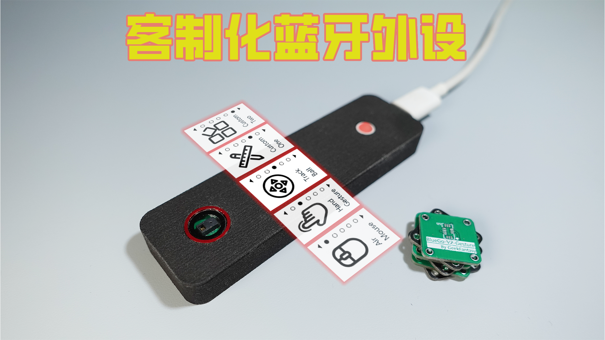

| Supported Targets | ESP32 | 
| ----------------- | ----- |

### 软件版本：
程序使用 VS Code开发，基于 ESP-IDF4.4，集成lvgl8.3.11.

### 项目介绍：

此设备是是一个基于BLE（低功耗蓝牙）的HID（人机交互）设备。它基于ESP32芯片开发，集成了手势识别模块PAJ7620, 惯性传感芯片MPU6500,还有一个五向按钮（v2换成了轨迹球），同时带有锂电池管理芯片，可以便携使用。

### 功能介绍：
现在最新是BlueGo v2,在原有基础上增加了电子墨水屏，按钮换成了轨迹球，能够支持一下功能，功能自定义已从APP移植到设备上。

* __空鼠 Air Mouse__,  它使用MPU6500的陀螺仪Y， Z轴的角度变化，转化成鼠标的x，y坐标，X轴角度变化转化成滚轮数据，使用五向按钮中的3个映射鼠标的左中右键。

* __手势控制__, 它采集PAJ7600的8个手势可以转化成操作手机的上下左右滑动，手指点击，返回等操作，从而可以手势操控手机。比较典型的应用是短视频软件的隔空操作。

* __键盘宏命令__，设备预置了各种键盘按键和组合键操作，这些操作可以映射到五向按钮或者8种手势上，作为外设服务电脑操作。典型应用如PPT遥控操作，手势控制虚拟桌面遥控拍照等。

* __功能自定制__，设备同时配备了一款Android App，通过BLE连接后，通过app可以实现手势，按钮不同功能的映射，还可以实现预定制的各种功能模式间自由切换。

### 硬件信息：
硬件的电路图，PCB以及BOM在嘉立创平台开源：  
BlueGo v2: https://oshwhub.com/geekfantasy/bluego-v1-0-0 (对应master分支）  
BlueGo v1: https://oshwhub.com/geekfantasy/fei-shu-shou-shi-cao-kong-wai-sh (对应bluego-v1分支）

